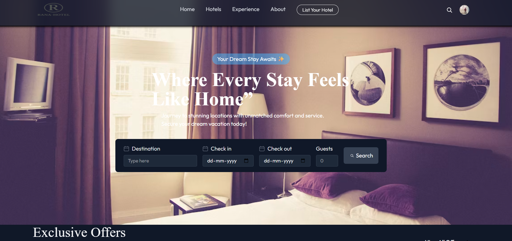
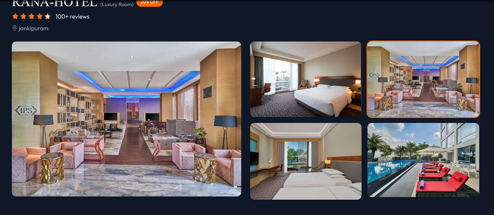
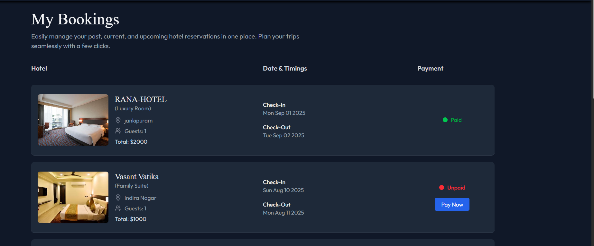
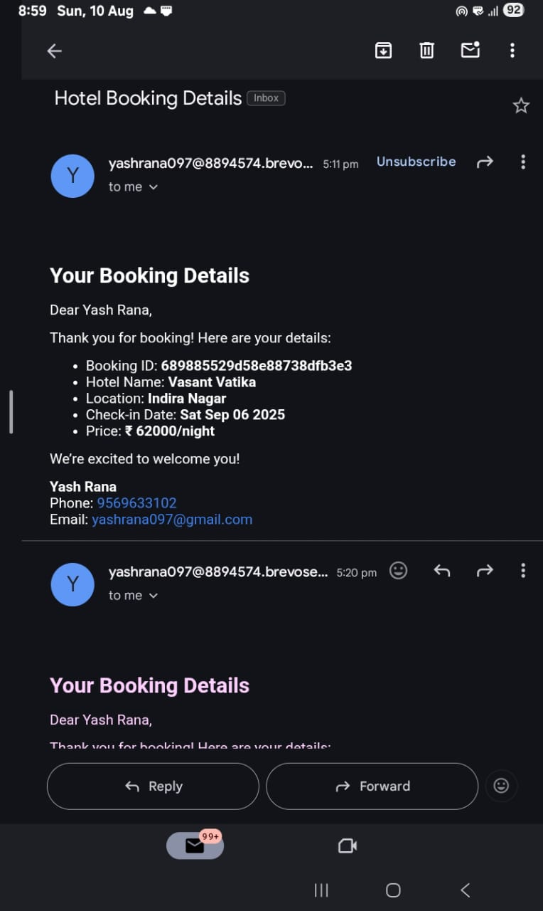

# 🏨 MERN Hotel Booking System

A fully functional Hotel Booking Website built using the **MERN Stack** (MongoDB, Express.js, React.js, Node.js) with **Clerk Authentication**, **Stripe Payment Integration**, and **Email Notifications**.

Users can browse hotels, book rooms, make payments online, and receive instant booking confirmations via email. Admins can add/manage hotel rooms and bookings from an **Admin Dashboard**.

---

## 🚀 Live Demo

🔗 [View Live](https://quick-booking-hotel.vercel.app)

---

## 📸 Screenshots

<p align="center">
  
  
</p>

<p align="center">
  
  
</p>

---

## ✨ Features

### 👥 User Features
- User Registration & Login using **Clerk**
- Pre-built UI Components from Clerk (Sign-in, Sign-up, Profile)
- Browse Hotels & Room Details
- Book Hotel Rooms with selected dates
- Online Payments using **Stripe Payment Gateway**
- Instant Email Confirmation after booking
- User Dashboard to view bookings

### 🛠️ Admin Features
- Add New Hotels & Rooms
- Manage Hotel Bookings
- View All Users & Payments

---

## 🧰 Tech Stack

### 💻 Frontend
- React.js – UI and Component Management
- Tailwind CSS – Styling
- Clerk – Authentication
- Axios – API Requests

### 🖥️ Backend
- Node.js – Server-side Logic
- Express.js – API Routing
- MongoDB – Database
- Mongoose – ODM
- Nodemailer – Email Notifications
- Stripe – Payment Gateway

---

## 📂 Folder Structure

```bash
hotel-booking/
├── backend/          # Node.js + Express API
│   ├── config/       # Database & API Configurations
│   ├── controllers/  # API Controllers
│   ├── models/       # Mongoose Models
│   ├── routes/       # API Routes
│   └── server.js     # Main Server File
│
├── frontend/         # React.js App
│   ├── src/
│   │   ├── components/ # Reusable Components
│   │   ├── pages/      # App Pages
│   │   ├── context/    # App Context
│   │   ├── assets/     # Images & Static Files
│   │   ├── App.js
│   │   └── main.jsx
│
├── screenshots/      # UI screenshots
└── README.md

```

---

## 🧰 Local Setup Instructions

### ✅ Requirements:
- Node.js installed
- MongoDB connection (local or Atlas)
- Clerk project keys
- Vite (comes with frontend)

---

### 1️⃣ Backend Setup

```bash
cd backend
npm install
```

Create a `.env` file in `/backend`:

```env
MONGO_URI=your_mongodb_connection_string
CLERK_SECRET_KEY=your_clerk_secret_key
STRIPE_SECRET_KEY=your_stripe_secret_key
STRIPE_WEBHOOK_SECRET=your_stripe_webhook_secret
EMAIL_HOST=smtp.your-email-provider.com
EMAIL_PORT=587
EMAIL_USER=your_email@example.com
EMAIL_PASS=your_email_password

```

Start the server:

```bash
npm start
```

---

### 2️⃣ Frontend Setup

```bash
cd ../frontend
npm install
```

Create a `.env` file in `/frontend`:

```env
VITE_CLERK_PUBLISHABLE_KEY=your_clerk_publishable_key
VITE_BACKEND_URL=http://localhost:5000
VITE_STRIPE_PUBLIC_KEY=your_stripe_public_key

```

Start the frontend:

```bash
npm run dev
```

> Frontend runs at `http://localhost:5173`

---

## 👨‍💻 Author

**Yash Rana**  
🎓 IET Lucknow  
📧 yashrana097@gmail.com  
🔗 [LinkedIn](https://www.linkedin.com/in/yashrana52)  
💻 [GitHub](https://github.com/YashRana52)
